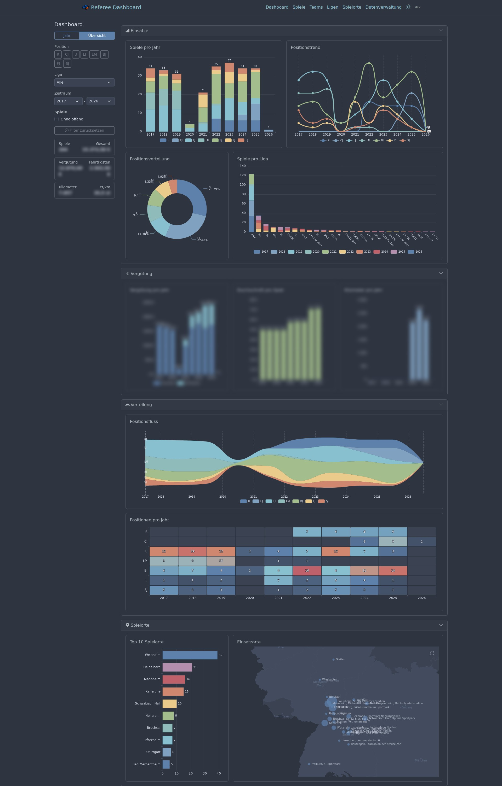
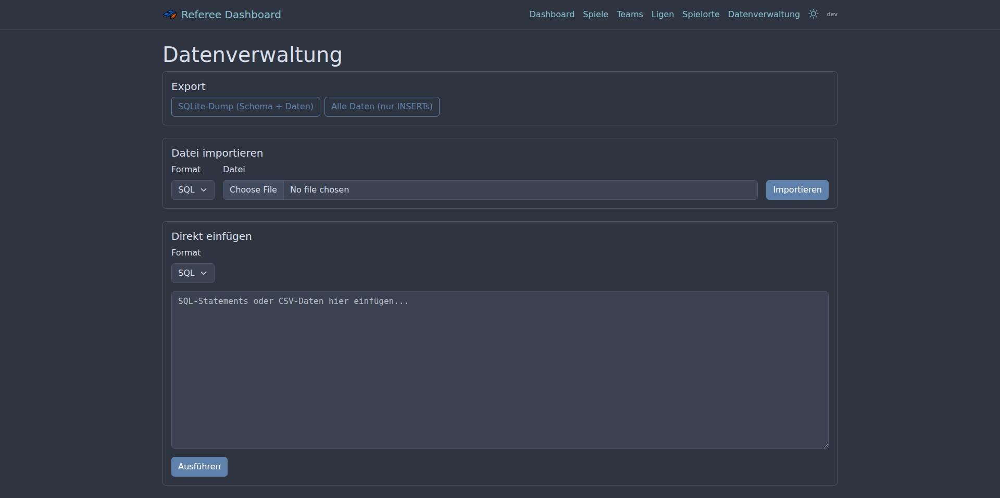

<p align="center">
  
</p>

<h1 align="center">Referee Dashboard</h1>

<p align="center">
  Self-hosted dashboard for managing American Football referee assignments, fees, and statistics.
</p>

---

## Features

- **Game Management** — Track games with date, teams, venue, league, position, fees, and travel costs
- **Team & League Management** — Maintain teams (with Bundesland) and leagues with sorting
- **Venue Management** — Manage venues with short names and Photon geocoding (komoot)
- **Dashboard** — Interactive ECharts visualizations with year and multi-year overview, calendar heatmap, geo map, ThemeRiver, bump charts
- **Import / Export** — Full database JSON export/import, CSV export per entity
- **Setup Wizard** — First-start setup page with seed data import, JSON restore, or empty database
- **Position Management** — Inline CRUD for referee positions on the data management page
- **Form Validation** — Server-side validation with inline error messages (German)
- **Dark / Light Mode** — Nord theme with persistent toggle (localStorage)
- **Healthcheck** — `/health` endpoint + CLI health command for Docker monitoring

## Screenshots

### Dashboard (Year View)


### Multi-Year Overview


### Games List


### Game Form


### Data Management


## Tech Stack

| Layer | Technology |
|-------|-----------|
| Backend | Go 1.26, chi v5 |
| Frontend | gomponents (HTML generation), Bootstrap 5.3, Bootstrap Icons |
| Charts | Apache ECharts 5 (geo map, bar, line, pie, heatmap, treemap, ThemeRiver) |
| Interactivity | htmx, Alpine.js |
| Database | bbolt (embedded key-value store, JSON documents) |
| IDs | ULIDs (time-sortable, via oklog/ulid) |
| Config | envconfig + godotenv |
| CLI | urfave/cli v3 |
| Deployment | Docker (FROM scratch), gosctl, just |
| Theme | Nord color palette (dark + light) |

**No npm, no build step, no templates** — HTML is generated server-side with [gomponents](https://maragu.dev/gomponents), assets loaded via CDN.

## Quick Start (Release Binary)

No Go installation required. Download the binary for your platform from the [Releases](https://github.com/AxelRHD/go-referee-dashboard/releases) page and run it:

```bash
./referee-dashboard
```

The app starts on [http://localhost:3000](http://localhost:3000). On first start, the setup wizard guides you through importing seed data.

Available platforms: Linux, macOS, Windows — each for amd64 and arm64.

## Development

### Prerequisites

- [Go 1.26+](https://go.dev/)
- [just](https://just.systems/) — command runner
- [air](https://github.com/air-verse/air) — hot-reload dev server (optional)

### Getting Started

```bash
# Clone the repository
git clone git@github.com:AxelRHD/go-referee-dashboard.git
cd go-referee-dashboard

# Start development server (with hot-reload)
just dev

# Or without air
go run ./cmd serve
```

### First Start — Setup Wizard

On first start with an empty database, the app redirects to `/setup` where you can choose:

1. **Neues Setup** — Import seed data (positions, leagues, teams, venues) via checkboxes. Ideal for a fresh start.
2. **Wiederherstellung** — Restore from a JSON export (file upload or paste). Use this to restore a backup.
3. **Leere Datenbank** — Skip seeding, start empty. Data can be added manually or imported later via `/data`.

After setup, the app redirects to the dashboard.

## Configuration

Configuration via `.env` file in the project root:

| Variable | Default | Description |
|----------|---------|-------------|
| `DB_PATH` | `referee.db` | Path to bbolt database file |
| `PORT` | `3000` | Server port |

## Just Recipes

```
just --list
```

### Development

| Recipe | Description |
|--------|-------------|
| `just dev` | Start dev server with hot-reload (air) |
| `just fmt` | Format code |
| `just vet` | Static analysis |
| `just test` | Run tests |

### Build

| Recipe | Description |
|--------|-------------|
| `just build` | Build static binary with git version |

### Deployment

| Recipe | Description |
|--------|-------------|
| `just deploy` | Full deploy: build + push image |
| `just build-image` | Build Docker image (uses local binary) |
| `just deploy-image` | Push image to server + prune old images |
| `just deploy-logs` | Show container logs |
| `just deploy-status` | Show container status |

## Deployment

The app is designed for self-hosting, e.g. on an OpenMediaVault (OMV) server with Docker.

### Architecture

```
Local (VM)                           Server (e.g. OMV)
┌──────────────┐                     ┌──────────────────────────┐
│ just build   │                     │                          │
│ just deploy  │──docker save/load──▶│ Docker image (scratch)   │
│              │                     │   Binary + static assets │
│              │                     │                          │
│              │                     │ appdata/                 │
│              │                     │   └── referee.db (bbolt) │
└──────────────┘                     └──────────────────────────┘
```

- **Docker image** is a single static binary + static assets (~15 MB)
- **Database** persists in the appdata volume as a single bbolt file
- **No migrations** — schema changes are handled by updating Go structs
- **Seed data** embedded in binary as JSON, available via setup wizard
- **Backup** — copy the `.db` file, or use JSON export on `/data`
- **Container lifecycle** managed via OMV Docker UI

### Docker Compose

```yaml
services:
  referee-dashboard:
    image: referee-dashboard
    container_name: referee-dashboard
    restart: unless-stopped
    ports:
      - "3001:3000"
    volumes:
      - CHANGE_TO_COMPOSE_DATA_PATH/referee-dashboard:/data
    healthcheck:
      test: ["CMD", "/referee-dashboard", "health"]
      interval: 30s
      timeout: 5s
      retries: 3
    environment:
      - DB_PATH=/data/referee.db
      - PORT=3000
```

### Version Tagging

The app displays its version in the navbar, derived from git tags:

```bash
git tag v0.4.0
just deploy
```

- Tagged commit → `v0.4.0`
- After commits → `v0.4.0-1-gabcdef`

## Data Management

### Export

The data management page (`/data`) provides a **JSON export** of the entire database. Each entity list page (Games, Teams, Leagues, Venues) also offers CSV and SQL export buttons.

### Import

- **JSON** — Restore a previously exported JSON file (replaces all data)
- **CSV** — Upload or paste CSV data with German headers, auto-resolves team/league names to IDs

CSV format uses semicolons (`;`) as delimiters and UTF-8 with BOM for Excel compatibility.

### Positions

Referee positions are managed inline on the data management page (`/data`). They are rarely changed and don't need a dedicated page.

## Project Structure

```
cmd/main.go              # Entry point (config + CLI)
cli/cli.go               # urfave/cli v3 (serve, health)
server/server.go         # chi router, middleware, route registration
config/config.go         # envconfig + godotenv
store/                   # bbolt-based data access layer
├── store.go             # DB open/close, bucket init, backup
├── types.go             # Domain structs + embedded ref types
├── leagues.go           # LeagueStore: List, Get, Put, Delete
├── teams.go             # TeamStore: List, Get, Put, Delete
├── venues.go            # VenueStore: List, Get, Put, Delete, UpdateCoords
├── games.go             # GameStore: List, Get, Put, Delete, ListBySeason, ListSeasons
├── positions.go         # PositionStore: List, Put, Delete
├── export.go            # JSON export/import (entire DB)
├── seed.go              # Batch seeding in single transaction
└── seed/                # Embedded JSON seed files
    ├── positions.json
    ├── leagues.json
    ├── teams.json
    └── venues.json
handler/                 # HTTP handlers per module
view/                    # gomponents views per module
validation/              # Form validation
static/
├── css/nord.css         # Nord theme overrides
├── js/dashboard.js      # Alpine.js dashboard component
├── js/echarts-nord.js   # ECharts Nord theme (dark + light)
├── js/germany.geo.json  # Germany GeoJSON for ECharts map
└── pfeife.png           # App icon
scripts/
└── screenshots.go       # Automated screenshot generation (chromedp)
```

## Screenshots Generation

Screenshots are generated automatically with chromedp. Financial data is automatically blurred.

```bash
# Requires chromium-browser in PATH and a running server
go run scripts/screenshots.go [base-url]
```

## License

[MIT](LICENSE)
