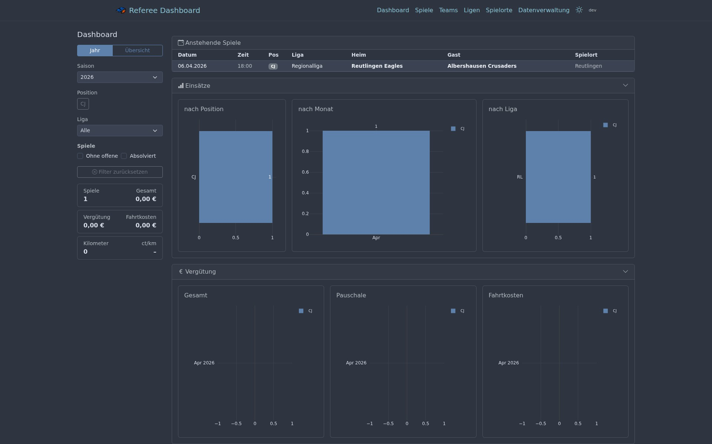
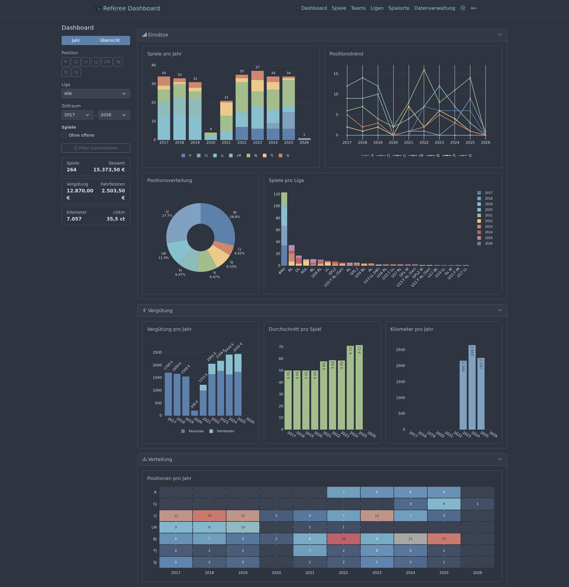
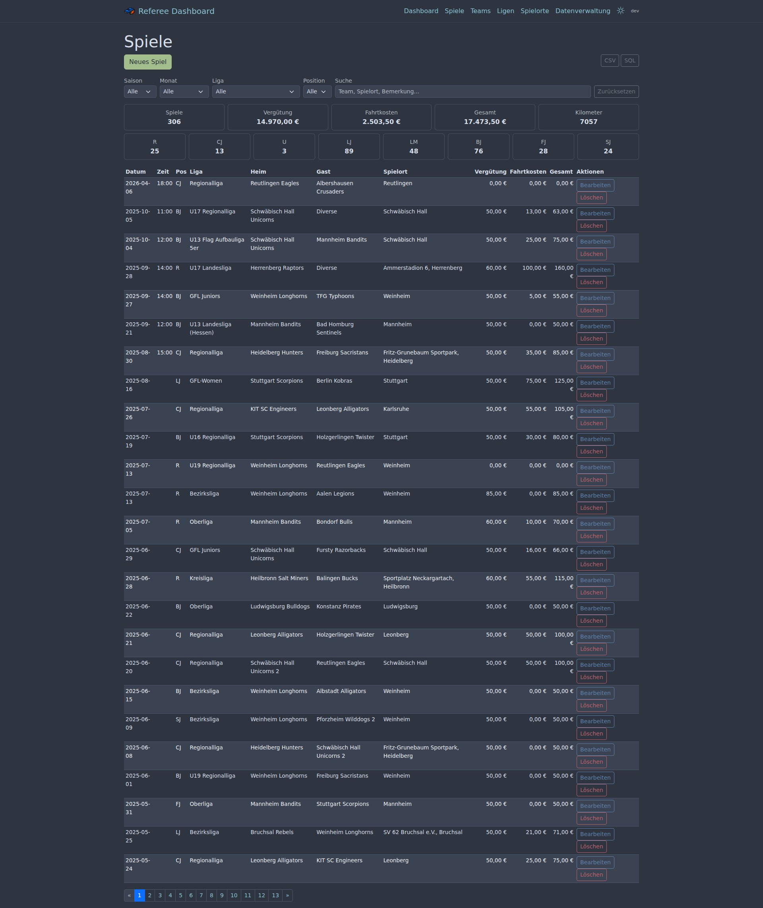
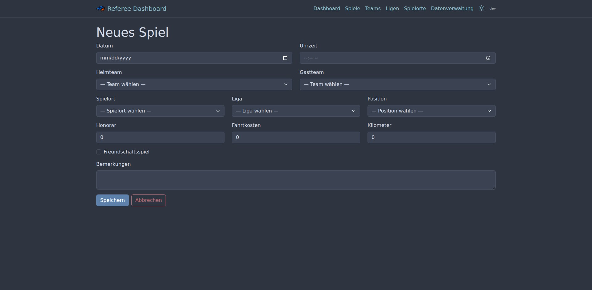

<p align="center">
  
</p>

<h1 align="center">Referee Dashboard</h1>

<p align="center">
  Self-hosted dashboard for managing American Football referee assignments, fees, and statistics.
</p>

---

## Features

- **Game Management** — Track games with date, teams, venue, league, position, fees, and travel costs
- **Team & League Management** — Maintain teams (with Bundesland) and leagues with sorting
- **Venue Management** — Manage venues with Photon geocoding (komoot)
- **Dashboard** — Multi-year overview with interactive Plotly.js charts, filters, and statistics
- **Import / Export** — CSV and SQL export per entity, SQLite dump, file upload and direct paste import
- **Form Validation** — Server-side validation with inline error messages
- **Dark / Light Mode** — Nord theme with persistent toggle (localStorage)
- **Healthcheck** — `/health` endpoint + CLI health command for Docker monitoring
- **Auto-Migration** — Database schema and seed data applied automatically on startup

## Screenshots

### Dashboard


### Multi-Year Overview


### Games List


### Game Form


### Data Management


## Tech Stack

| Layer | Technology |
|-------|-----------|
| Backend | Go 1.26, chi v5 |
| Frontend | gomponents (HTML generation), Bootstrap 5.3, Bootstrap Icons |
| Interactivity | htmx, Alpine.js, Plotly.js |
| Database | SQLite via modernc.org/sqlite (pure Go, no CGO) |
| Schema | goose (migrations) + sqlc (type-safe queries) |
| Config | envconfig + godotenv |
| CLI | urfave/cli v3 |
| Deployment | Docker (FROM scratch), gosctl, just |
| Theme | Nord color palette |

**No npm, no build step, no templates** — HTML is generated server-side with [gomponents](https://maragu.dev/gomponents), assets loaded via CDN.

## Prerequisites

- [Go 1.26+](https://go.dev/)
- [just](https://just.systems/) — command runner
- [sqlc](https://sqlc.dev/) — SQL code generator (development only)
- [air](https://github.com/air-verse/air) — hot-reload dev server (optional)

## Getting Started

```bash
# Clone the repository
git clone git@github.com:AxelRHD/referee-dashboard.git
cd referee-dashboard

# Start development server (with hot-reload)
just dev

# Or without air
go run ./cmd serve
```

The app will be available at [http://localhost:3000](http://localhost:3000).

On first start, the database is created automatically with seeded referee positions (R, CJ, U, LJ, LM, BJ, FJ, SJ) and a placeholder venue.

## Configuration

Configuration via `.env` file in the project root:

| Variable | Default | Description |
|----------|---------|-------------|
| `DB_PATH` | `referee.db` | Path to SQLite database file |
| `PORT` | `3000` | Server port |
| `DEBUG` | `false` | Enable debug mode |
| `SECRET_KEY` | `change-me-in-production` | Session secret key |

## Just Recipes

```
just --list
```

### Development

| Recipe | Description |
|--------|-------------|
| `just dev` | Start dev server with hot-reload (air) |
| `just fmt` | Format code |
| `just vet` | Static analysis |
| `just test` | Run tests |

### Build

| Recipe | Description |
|--------|-------------|
| `just build` | Build static binary with git version |

### Database

| Recipe | Description |
|--------|-------------|
| `just migrate` | Run goose migrations |
| `just seed` | Seed positions + placeholder venue |
| `just generate` | Generate sqlc code from queries |

### Deployment

| Recipe | Description |
|--------|-------------|
| `just deploy` | Full deploy: build + push image |
| `just build-image` | Build Docker image (uses local binary) |
| `just deploy-image` | Push image to server + prune old images |
| `just deploy-logs` | Show container logs |
| `just deploy-status` | Show container status |

## Deployment

The app is designed for self-hosting, e.g. on an OpenMediaVault (OMV) server with Docker.

### Architecture

```
Local (WSL)                          Server (e.g. OMV)
┌──────────────┐                     ┌──────────────────────────┐
│ just build   │                     │                          │
│ just deploy  │──docker save/load──▶│ Docker image (scratch)   │
│              │                     │   Binary + static assets │
│              │                     │                          │
│              │                     │ appdata/                 │
│              │                     │   └── referee.db         │
└──────────────┘                     └──────────────────────────┘
```

- **Docker image** is a single static binary + static assets (~15 MB)
- **Database** persists in the appdata volume
- **Migrations** run automatically on startup (embedded in binary)
- **Container lifecycle** managed via OMV Docker UI

### Docker Compose

```yaml
services:
  referee-dashboard:
    image: referee-dashboard
    container_name: referee-dashboard
    restart: unless-stopped
    ports:
      - "3001:3000"
    volumes:
      - CHANGE_TO_COMPOSE_DATA_PATH/referee-dashboard:/data
    healthcheck:
      test: ["CMD", "/referee-dashboard", "health"]
      interval: 30s
      timeout: 5s
      retries: 3
    environment:
      - DB_PATH=${DB_PATH}
      - PORT=${PORT}
      - DEBUG=${DEBUG}
      - SECRET_KEY=${SECRET_KEY}
```

### Version Tagging

The app displays its version in the navbar, derived from git tags:

```bash
git tag v0.2.0
just deploy
```

- Tagged commit → `v0.2.0`
- After commits → `v0.2.0-1-gabcdef`

## Data Management

### Export

Each list page (Games, Teams, Leagues, Venues) offers CSV and SQL export buttons with timestamps. The data management page (`/data`) provides:

- **SQLite Dump** — Complete backup with schema and data
- **All Data Export** — INSERT statements for all tables in FK order

### Import

- **SQL** — Paste or upload INSERT/CREATE TABLE statements (DROP, DELETE, UPDATE are blocked)
- **CSV** — Upload or paste CSV data with German headers, auto-resolves team/league names to IDs

CSV format uses semicolons (`;`) as delimiters and UTF-8 with BOM for Excel compatibility.

## Project Structure

```
cmd/main.go              # Entry point (config + CLI)
cli/cli.go               # urfave/cli v3 (serve, migrate, seed, health)
server/server.go         # chi router, middleware, route registration
config/config.go         # envconfig + godotenv
handler/                 # HTTP handlers per module
view/                    # gomponents views per module
model/                   # sqlc-generated code (do not edit!)
validation/              # Form validation
db/
├── embed.go             # Embedded migrations (go:embed)
├── migrations/          # Goose SQL migration files
└── queries/             # sqlc SQL query files
static/
├── css/nord.css         # Nord theme overrides
└── pfeife.png           # App icon
scripts/
└── screenshots.go       # Automated screenshot generation (chromedp)
```

## Screenshots Generation

Screenshots are generated automatically with chromedp:

```bash
# Requires chromium-browser in PATH
go run scripts/screenshots.go [base-url]
```

## License

Private project — not licensed for redistribution.
